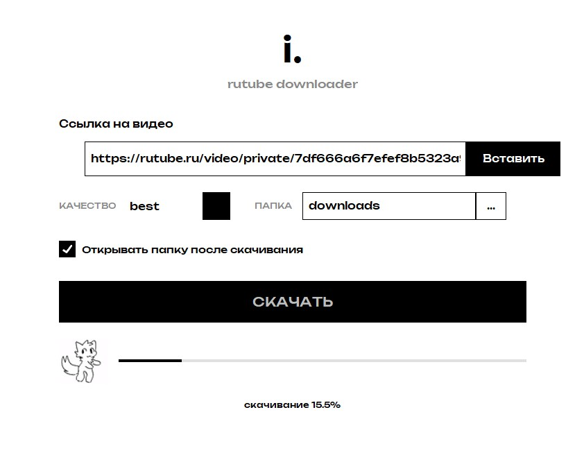

# i. Rutube Downloader

Десктопная программа для Windows, которая скачивает видео с **Rutube** в максимальном качестве — вплоть до 4K. Работает с публичными роликами и с приватными ссылками, у которых есть ключ доступа.

Один исполняемый файл. Никакой установки, регистрации и рекламы.



## Возможности

- Скачивание до **4K**
- Приватные ссылки с ключом доступа
- Выбор качества: `best`, 1080p, 720p, 480p, 360p
- Склейка видео и аудио в один `.mp4` через ffmpeg
- Выбор папки для сохранения
- Автоматическое открытие папки после скачивания
- Прогресс-бар и статус прямо в окне
- Вставка ссылки кнопкой, `Ctrl+V` или правой кнопкой мыши
- Бесплатно, без телеметрии

## Скачать

▶ **[Скачать программу](https://doinwor.github.io/rutube-downloader/)** — лендинг с кнопкой загрузки

▶ **[Релизы на GitHub](https://github.com/Doinwor/rutube-downloader/releases)** — прямая ссылка на `.exe`

| | |
|---|---|
| ОС | Windows 10 / 11 (64 бит) |
| Размер | ≈ 50 МБ |
| Установка | не требуется |
| Стоимость | бесплатно |

## Запуск из исходников

```bash
git clone https://github.com/Doinwor/rutube-downloader.git
cd rutube-downloader
pip install -r requirements.txt
python main.py
```

Требуется установленный **ffmpeg** в `PATH`, если запускать из исходников (в собранном `.exe` он уже встроен).

## Сборка `.exe`

```bash
pip install pyinstaller
python -m PyInstaller --onefile --windowed --name "i. Rutube Downloader" main.py
```

Готовый файл появится в `dist/`.

## Структура

| Файл | Назначение |
|---|---|
| `main.py` | точка входа |
| `gui.py` | интерфейс на CustomTkinter |
| `downloader.py` | обёртка над yt-dlp с прогрессом |
| `requirements.txt` | зависимости |
| `tenor.gif` | анимация в окне прогресса |

## Технологии

Python · yt-dlp · ffmpeg · CustomTkinter · PyInstaller · Unbounded

## Лицензия

MIT

---

Создано студией **[і.](https://doinwor.github.io/go-ecosystem/i-site/)**
